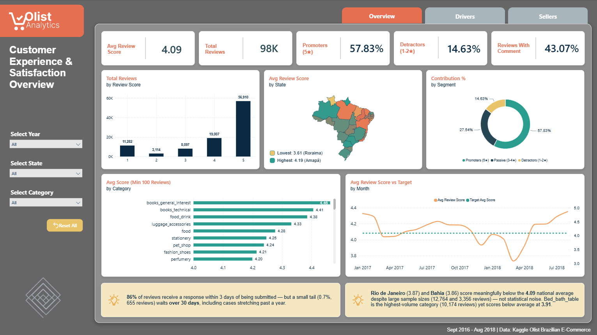
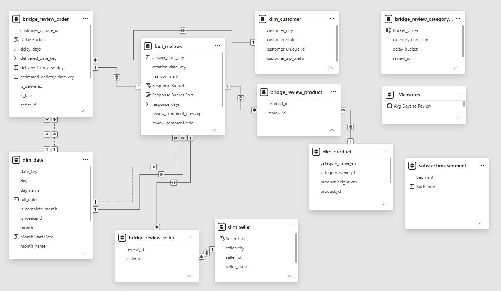
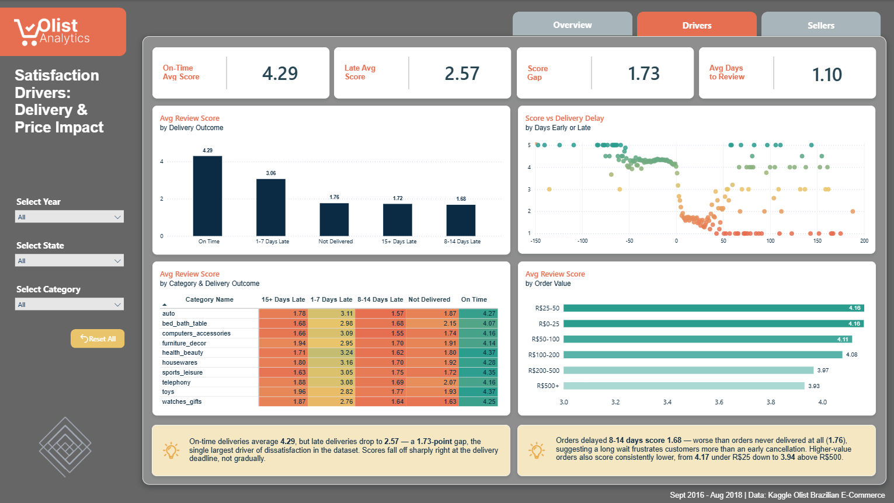
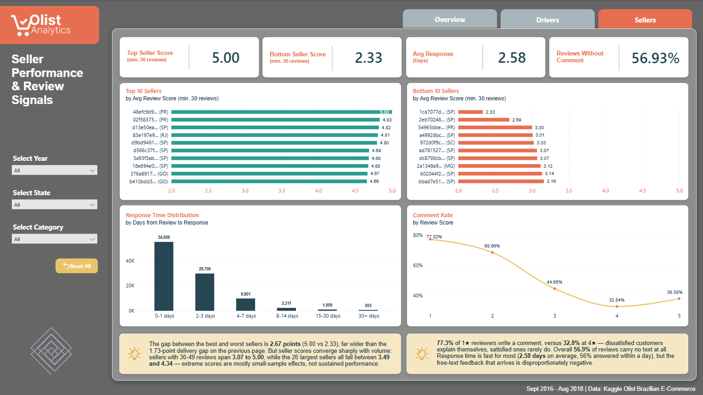

# Olist E-Commerce — Customer Experience & Satisfaction Dashboard

A 3-page Power BI dashboard analyzing review scores, satisfaction drivers, and seller-level review signals for Olist, a Brazilian multi-vendor e-commerce marketplace. Built end-to-end from raw CSVs — data cleaning, star schema design, DAX modeling, and dashboard design. Third and final part of a 3-part portfolio series on the Olist dataset ([Part 1: Sales & Revenue Performance](https://github.com/siamsadman/olist-sales-dashboard) · [Part 2: Logistics & Delivery Performance](https://github.com/siamsadman/olist-logistics-dashboard)).

**[.pbix Download ▸](dashboard/olist_customer_satisfaction_dashboard.pbix)**

> **About this project:** I'm a Senior BI/Reporting Analyst with 9+ years of experience building automated reporting pipelines and Power BI dashboards in production environments. This project — recently completed alongside earning the Microsoft PL-300 certification — is a from-scratch demonstration of that same end-to-end process on a public dataset: raw data, real data quality problems, a fully modeled star schema, and dashboard design, documented the way I'd document a production deliverable. [Connect on LinkedIn](https://www.linkedin.com/in/siam-sadman)



---

## Why This Dataset

Same dataset as Parts 1 and 2 of this series ([Olist Brazilian E-Commerce](https://www.kaggle.com/datasets/olistbr/brazilian-ecommerce)), third business angle. Part 1 asked "how is the business performing." Part 2 asked "how well is the business fulfilling its promises." This project asks the question that connects them: **what actually makes customers unhappy, and can we prove it?**

That framing is what makes this the right closing project for the series. The satisfaction data doesn't stand alone — the strongest finding here is a direct quantification of Part 2's operational metrics in customer terms. Late delivery isn't just an SLA miss; it costs 1.73 review points. Building all three on one dataset was deliberate: the same source can support genuinely distinct analyses depending on which tables and grains you center the model around, and the third one gets to draw on the first two.

---

## Tech Stack

- **SQL Server** (Dockerized) — staging, transformation, star schema
- **Python (pandas)** — data cleaning (null handling, boolean encoding, bridge extraction)
- **Power BI Desktop** — data modeling, DAX, dashboard design
- **Navicat Premium** — database administration, CSV import

---

## Data Model

A star schema centered on a review-grain fact table with three bridge tables, reusing the shared dimensions (`dim_date`, `dim_customer`, `dim_seller`, `dim_product`) from Parts 1 and 2 without modifying any existing table.



**Fact table:**
- `fact_reviews` — grain: one row per review. Score, comment flag, comment text, creation and answer date keys, and response time in days. 98,410 rows.

**Bridge tables:**
- `bridge_review_order` — resolves the many-to-many between reviews and orders, and carries the order-level delivery and value attributes the Drivers page needs. 99,224 rows.
- `bridge_review_seller` — review ↔ seller. 99,549 rows.
- `bridge_review_product` — review ↔ product. 102,172 rows.
- `bridge_review_category_delay` — a deliberately **disconnected**, pre-flattened table. 103,831 rows. See below.

**Dimensions (reused from Parts 1 and 2, unmodified):** `dim_date`, `dim_customer`, `dim_seller`, `dim_product`

### Why reviews and orders need a bridge

The obvious design is a single `order_id` column on the review table. It's also wrong, and quietly so. In this dataset 789 review IDs appear against more than one order, and 547 orders carry more than one review (maximum 3). The duplicated review rows are identical on every field except `order_id`, so a careless `DISTINCT` hides the problem rather than solving it.

Flattening this to one order per review would either duplicate reviews or silently drop order associations. `bridge_review_order` resolves it as two clean many-to-one hops. This is the third distinct many-to-many in the series — Part 1 needed one for orders ↔ payments, Part 2 needed two more — and each was verified with a count query before the bridge was built, not assumed from the table names.

### Why one table is deliberately disconnected

The category-by-delivery-outcome heatmap on page 2 has to cross two independent many-to-many bridges in a single filter context: product category through one, delivery delay through another. Three separate DAX approaches all returned wrong-but-plausible numbers — the standard failure mode when averaging across two unrelated many-to-many paths.

Rather than keep iterating on DAX that produced numbers I couldn't independently reproduce, I pre-flattened the join in SQL into `bridge_review_category_delay` and left it with no relationships at all in the model. The heatmap reads it directly. The result is deterministic and matches the validation queries exactly.

It's an unglamorous solution and it breaks the clean star, which is precisely why it's documented here rather than hidden: knowing when to stop fighting the model and move the work to SQL is part of the job. The row count (103,831) legitimately exceeds the review count, because a review spanning several products in different categories produces one row per review/category/bucket combination.

### Why a self-contained schema

Parts 1 and 2 are published and live. Every object in this project is new, and the four shared dimensions are read but never written. `dim_date` was checked against this project's full date range before any fact load — it already spanned 2016-09-04 to 2018-11-12, so unlike Part 2 no extension was needed. Verifying that up front is the point; Part 2 discovered its gap as a foreign key violation mid-load.

---

## Data Quality: What I Found and How I Handled It

| Issue Found | Resolution |
|---|---|
| Reviews ↔ orders is a genuine many-to-many (789 reviews span multiple orders; 547 orders carry multiple reviews) | Built `bridge_review_order` rather than forcing a false one-to-one. Verified with count queries before designing the schema |
| `review_comment_title` is 88.3% blank | Collapsed title and message into a single `has_comment` flag; the title column is retained for reference but no measure depends on it |
| 5,127 reviews (5.4%) have a **negative** delivery-to-review interval — the review predates the recorded delivery timestamp | Investigated as a possible timestamp-rounding artifact and ruled out: only 56% fall within -7 days, with a much deeper tail. Treated as unreliable timing data and excluded from `[Avg Days to Review]` via a `>= 0` filter. Rows retained so the anomaly stays inspectable |
| 759 rows have a NULL `order_value` | Confirmed as the known ~775 zero-item orders from Part 1 (cancelled or unavailable before fulfillment). Bucketed as "Unknown" and filtered out of the price chart rather than coerced to zero — a cancelled order is not an order worth R$0 |
| 701 reviews have no seller attribution at all | Same root cause. Documented rather than silently dropped: seller-level review counts do not sum to the review total, so any "share of all reviews" measure at seller grain overstates slightly |
| `BLANK() = FALSE` evaluates to `TRUE` in DAX — `is_late = FALSE` silently swept in 2,865 never-delivered orders | Added explicit `NOT ISBLANK()` guards. Without the guard the on-time count read 91,523 instead of 88,658 and the on-time average read 4.22 instead of 4.29 — an error that flatters the result and would have shipped invisibly |
| Bridge relationships defaulted to single-direction cross-filtering, silently preventing filters from reaching `fact_reviews` | Set all three bridges to bidirectional. Caught the same way as in Part 2: every category rendering an identical value is the symptom |
| Averaging review scores across two independent many-to-many bridges (category via one, delivery delay via another) returned wrong-but-plausible results through three separate DAX approaches | Pre-flattened the join in SQL into a standalone, deliberately disconnected table. Deterministic, and matches the validation queries exactly |
| `category_name_en` exists in both `dim_product` and the flattened table, with no relationship between them | Dragging the wrong one into a visual makes every matrix row show the identical grand total. Fixed by verifying the source table of every field, not just its name |
| Declaring comment columns as `NVARCHAR(MAX)` collapsed CSV import to ~10 rows/sec | Bounded to `NVARCHAR(4000)`; the same 98K-row import dropped from 10+ minutes to 41 seconds |
| pandas writes booleans as `True`/`False`, which SQL Server's `BIT` type rejects | Added `.astype(int)` before `to_csv()` in the cleaning script |
| Oct–Dec 2016 carries negligible volume (176 / 101 / 45 reviews) | Excluded from trend visuals only, via a visual-level filter. Same treatment Parts 1 and 2 gave the partial Sept 2018 extract; the rows remain in all totals and KPIs |
| Category `Unknown` (n=1,457) is a translation residue, not a business category | Excluded from category rankings. The source also contains a genuine typo category, `costruction_tools_garden`, distinct from `garden_tools` — retained as-is, since silently merging it would misstate the source |

---

## Key Modeling Decisions

**Every measure was validated against an independent SQL query before being trusted in a visual.** This is the discipline the whole project rests on, and it isn't a formality — it caught three real bugs that would otherwise have shipped silently: the blank-handling error above, a wrong-table field binding that flattened an entire matrix, and a cross-filter direction that made every category look identical. All of those queries are published in [`sql/03_validation.sql`](sql/03_validation.sql) with expected values stated inline, so every figure on the dashboard can be traced back to the query that confirmed it.

**Minimum sample size for seller rankings, chosen from the distribution rather than guessed.** Seller rankings require at least 30 reviews. That number came from a threshold sweep, not intuition: at a threshold of 5, thirty-six sellers sit tied at a perfect 5.00, which makes any Top 10 ranking arbitrary. That collapses to two sellers at ≥10 and one at ≥20. At ≥30 the ranking is stable (rank 10 at 4.66 is cleanly separated from ranks 11–12 at 4.64), 630 sellers still qualify, and 83.2% of review links are retained. It also matches the seller threshold used in Part 2.

**Extreme seller scores are mostly small-sample noise, and the dashboard says so.** Average scores are flat across volume bands (4.14 / 4.12 / 4.09 / 4.10 / 4.08), so high-volume sellers do *not* score worse — a plausible-looking hypothesis the data killed. What does change is the range: sellers with 30–49 reviews span 3.07 to 5.00, while the 26 largest sellers all fall between 3.49 and 4.34. The page carries that caveat directly in a callout, because a Top 10 chart invites exactly the wrong conclusion without it.

**Rate measures defined by subtraction where possible.** `[Pct No Comment]` is defined as `1 - [Comment Rate]` rather than as a `has_comment = FALSE` test. Both return 56.93% here, but the subtraction is immune by construction to the blank-comparison trap, and it guarantees that pages 1 and 3 reconcile permanently rather than by coincidence.

**Role-playing date dimension.** `fact_reviews` and `bridge_review_order` relate to `dim_date` four times in total (review creation, review answer, delivery, estimated delivery). Only review creation is active; the rest are invoked with `USERELATIONSHIP()`. Only one can be active at a time — the direct path from the bridge and the path through the fact table together form a loop.

**Trend visuals exclude statistically thin months.** Monthly trends are filtered to Jan 2017 – Aug 2018. Outside that window monthly review counts fall to 45–176, against 5,000–9,000 in a typical month, which lets a handful of reviews swing the average enough to produce a misleading spike at the edge of the chart.

---

## Dashboard Pages

### 1. Customer Experience & Satisfaction Overview
Top-line satisfaction KPIs, score distribution, a state-level satisfaction map, the promoter/passive/detractor split, and score trend against the national average — the 30-second summary of how customers feel.


### 2. Satisfaction Drivers: Delivery & Price Impact
The core causal analysis — average score by delivery outcome, a score-versus-delay scatter, a category-by-delivery-outcome heatmap, and score by order value. This is the page that quantifies Part 2's operational findings in customer-satisfaction terms.



### 3. Seller Performance & Review Signals
Seller-level review performance with a minimum-sample threshold applied, response time distribution, and the relationship between review score and whether a customer bothered to write anything at all.



All three pages share a synced filter panel (Year, State, Category) and carry hand-authored analyst callouts. Every figure quoted in a callout was confirmed against SQL before it was written — no callout was drafted from a number read off a chart.

---

## Notable Findings

- **Late delivery is the single largest driver of dissatisfaction in the dataset.** On-time deliveries average 4.29; late deliveries average 2.57 — a 1.73-point gap. Scores fall off sharply right at the delivery deadline rather than degrading gradually, which suggests customers are reacting to the broken promise itself, not to waiting per se.
- **A long wait is worse than no delivery at all.** Orders delayed 8–14 days score 1.68, *below* orders that were never delivered (1.76). Customers appear to forgive an early cancellation more readily than an extended, unresolved wait — an actionable signal for how to handle orders that are already running late.
- **Unhappy customers explain themselves; satisfied ones don't.** Comment rate falls from 77.3% at 1 star to 32.8% at 4 stars, then ticks back up to 38.1% at 5 stars. The overall 43.07% comment rate badly understates how much written feedback concentrates in the 1–2 star bucket — which means free-text review mining on this platform is disproportionately sampling the unhappy.
- **Extreme seller scores are mostly small-sample effects.** The best and worst qualifying sellers differ by 2.67 points, but that spread collapses as volume rises: 30–49 review sellers range across 1.93 points, while the 26 largest sellers span only 0.85. Seller-level satisfaction converges hard toward the 4.09 platform average.
- **Higher-value orders score consistently lower**, from 4.16 under R$50 down to 3.93 above R$500 — a modest but monotonic decline, suggesting expectations scale with price faster than service does.
- **Response is fast for almost everyone, and glacial for a few.** 86% of reviews get a response within 3 days, but a 655-review tail waits over 30 days, with the longest cases stretching past a year.

---

## Repository Structure

```
/olist-customer-satisfaction-dashboard
├── README.md
├── sql/
│   ├── 00_staging_prep.sql    — staging DDL + post-import verification
│   ├── 01_schema.sql          — fact_reviews + bridge table DDL
│   ├── 02_load_facts.sql      — fact/bridge population scripts
│   └── 03_validation.sql      — data quality checks + DAX measure validation
├── scripts/
│   ├── data_cleaning.py       — reviews cleaning + bridge extraction
│   ├── clean_orders.py        — delivery timestamp cleaning (true nulls)
│   ├── explore_reviews.py     — exploratory analysis
│   └── verify_cleaned_data.py — pre-import validation
├── dashboard/
│   └── olist_customer_satisfaction_dashboard.pbix
├── images/
│   ├── page1_overview.png
│   ├── page2_drivers.png
│   ├── page3_sellers.png
│   └── data_model.png
├── requirements.txt
└── LICENSE
```

---

## About

Built by Siam Sadman as part of a portfolio project.

[www.linkedin.com/in/siam-sadman](http://www.linkedin.com/in/siam-sadman)
